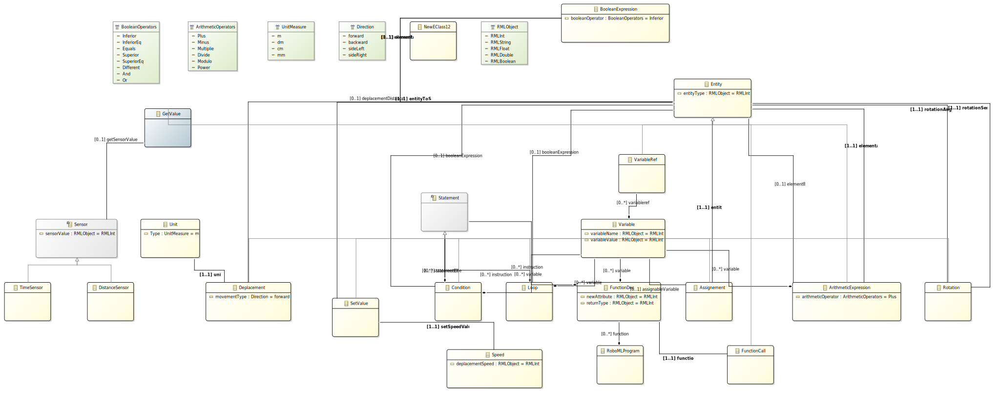

<h1 align="center">TP PROJET ASE - ROBOML </h1>

   
   
   

<h3 align="left">
    <b>Autors : </b> <a href="https://github.com/Thomega35/">Thomas DELAPART</a> & <a href="https://github.com/Xacone">Yazid BENJAMAA</a>
</h4>

> Le projet est accessible sur le site : [RoboML](https://cv.thomega.fr/) 

# Présentation du Projet

Le projet RoboML est un projet de langage de programmation permettant de définir le déploiement d'un robot. Le langage permet de controler les déplacements du robot ainsi que de gérer des variables et des fonctions. Ce langage inspiré du Python est compilé en Arduino C.
### Usefull links :

- [Subject](https://github.com/selabs-ur1/dsl)

- [Languium_Git](https://github.com/eclipse-langium/langium)

- [Languium_WebSite](https://langium.org/docs/getting-started/)

- [Xtext_to_langium](https://github.com/TypeFox/xtext2langium)

- [Arduino](https://create.arduino.cc/editor/)

<h2>Modèle et Quelques Concepts du Langage</h2>

<ul>
    <li><b>ArithmeticOperators</b> : Opérateurs arithmétiques (+, -, *, **, %, ...)</li>
    <li><b>Assignement</b> : Représente une assignation d'une valeur à une variable</li>
    <li><b>BooleanExpression</b> : Représente une expression logique, avec des opérateurs logiques</li>
    <li><b>BooleanOperators</b> : Opérateurs booléens supportés par le langage (==, <, >, <=, ...)</li>
    <li><b>Condition</b> : Représente une condition logique, comme une comparaison.</li>
    <li><b>Entity</b> : Représente une entité, avec un type spécifié.</li>
    <li><b>RMLObject</b> : Objets propres au langage RoboML (RMLInt, RMLString, RMLFloat, RMLDouble, RMLBoolean)</li>
    <li><b>RoboMLProgram</b> : Point d'entrée du langage, englobe l'ensemble du programme RoboML</li>
    <li><b>Sensor</b> : Représente un capteur, avec la possibilité d'obtenir la valeur du capteur.</li>
    <li><b>Speed</b> : Spécifie la vitesse de déplacement.</li>
    <li><b>Statement</b> : Représente une instruction comme une assignation, une condition ou encore une boucle.</li>
    <li><b>UnitMeasure</b> : Unité de mesure des distances (m, dm, cm, mm)</li>
    <li><b>Variable</b> : Représente une variable identifiée par son nom et sa valeur associée</li>
    <li><b>VariableRef</b> : Référence une variable existante dans le programme.</li>
</ul>

<h2>Intérpréteur</h2>

<h2>Compilateur</h2>

<h2>Exemples de codes</h2>
